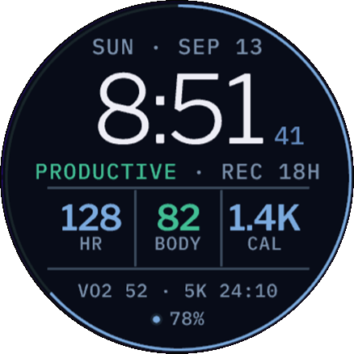

# FanFace

**A training-dashboard watch face for the Garmin epix Pro (Gen 2), designed like a page from
[fan-zhu.com](https://fan-zhu.com).** One steel-blue hue, two verdict colors, and a strict typographic
grid turn a wristful of training metrics into something that reads at a glance and looks like a
finished product, not a sports HUD.

<p align="center">
  
  <br>
  <em>Rendered at true size on the 1.3-inch, 416 × 416 AMOLED display (sample data shown).</em>
</p>

The face answers three training questions in one glance:

1. **Can I go hard today?** Body Battery and recovery time.
2. **Is my load trending the right way?** Training Status, running VO2max, and 5K race prediction.
3. **Am I banking enough cardio this week?** Weekly intensity minutes versus goal, drawn as the outer ring.

The central panel keeps the three numbers you check most, heart rate, Body Battery, and calories burned
today, large and legible. Calories abbreviate cleanly (`850` under a thousand, `1.4K` or `2.3K` above),
so a busy day never breaks the layout.

## Highlights

- **Reads like your website, not a gadget.** Colors, fonts, and hairline rules are ported straight from
  the site's dark theme: Libre Franklin for the time, IBM Plex Mono for every label, a single
  steel-blue accent, and green/red used *only* as verdicts (a strong Body Battery goes green, a low one
  red; Training Status shows Productive in green, Overreaching in red).
- **A real typographic system.** The site's typefaces are shipped as hand-generated bitmap fonts, sized
  specifically for a 33 mm screen: an 84 px time, ~30 px stat values, and labels no smaller than a
  readable 15 px cap height. Nothing is an afterthought at arm's length.
- **System-computed training metrics.** Body Battery, Training Status, recovery time, VO2max, and the
  5K prediction come from Garmin's Complications API, the same numbers the watch's own glances show, with
  `ActivityMonitor` and `UserProfile` as fallbacks. Every metric degrades gracefully to `--` when the
  watch has not computed it yet, and a missing sensor never crashes the face.
- **Built for battery.** Data is pulled at most once per minute, never per second. Fonts load once. There
  are no timers and no animation. The always-on view draws only the time, in a dimmed tone on black,
  micro-shifted each minute to protect the AMOLED panel, well inside Garmin's pixel budget.
- **One design, three watches.** Every coordinate is a fraction of the screen, so the 42 mm, 47 mm, and
  51 mm epix Pro all render the same proportioned face from one code base.
- **Tap to drill in.** Tapping the heart-rate, Body Battery, or calories cell opens that metric's native
  Garmin glance.
- **A true-size preview tool.** Because the simulator draws the watch several times larger than life, the
  repo ships a companion tool (`tools/preview/`) that mirrors the simulated display at its real physical
  size using the monitor's actual pixel density, so type is judged the way it will be worn.

## Layout

```
          SUN · SEP 13                date            eyebrow, tight above the time
           10:08  37                  time            Libre Franklin Light; seconds receded
     PRODUCTIVE · REC 18H             coach line      training status in bull/bear; panel header
   ──────────┬────────┬──────────     panel top rule (also the coach underline), visible steel
     128     │   82   │   2.3K        values          accent (Body Battery tints bull/bear)
     HR      │  BODY  │   CAL         labels          mono, muted
   ──────────┴────────┴──────────     panel bottom rule
        VO2 52 · 5K 24:10             footer
          ● 78% · 3                   phone dot, battery, notifications
```

Vertical rhythm: the whole stack is centered in the circle (not sitting low), so the top does not read
as dead space. Three even zones: date+time, coach+panel, footer+battery. The date+time pair rides high
enough that the gap below the time (into the coach line) matches the gap below the panel (into the
footer), so no zone feels crowded. The middle zone is one framed stats panel whose top rule doubles as
the coach line's underline, so there is a single strong divider rather than two faint ones; each cell's
value and label are centered between the rules. Structural rules use a brighter steel (`Theme.GRID`),
stroked at `Layout.railPen` (~3 px, scaled to the screen) so sections read clearly at arm's length; only
the intensity ring track stays intentionally faint.

Always-on display shows the time only, in the receded accent tone on black, micro-shifted each minute.

## Devices

`epix2pro47mm` (416×416, primary), `epix2pro42mm` (390), `epix2pro51mm` (454). Every coordinate is a
fraction of the screen size. Minimum API level 4.2.0 (Complications).

## Project layout

```
manifest.xml, monkey.jungle
source/
  FanFaceApp.mc        entry point; returns [view, delegate]
  FanFaceView.mc       lifecycle + drawing
  FanFaceDelegate.mc   onPress on a rail cell -> opens the native glance
  Metrics.mc           complication subscriptions, minute-gated pulls, fallbacks
  Layout.mc            ratio-based coordinates
  Theme.mc             site color tokens
  Fmt.mc               formatting + bull/bear rules
resources/
  fonts/               bitmap fonts (.fnt + .png) and fonts.xml
  drawables/           launcher icon (SVG port of the site's brand mark)
  settings/            app setting: show seconds while awake
  strings/
tools/
  FontGen.java         generates the bitmap fonts from the TTFs (see below)
```

## Build and run

Prerequisites: Connect IQ SDK (via the SDK Manager), the Monkey C VS Code extension, a JDK, and a developer key
(`Monkey C: Generate a Developer Key`; set `monkeyC.developerKeyPath` in your user settings).

- **Simulator:** press `F5` in VS Code and pick a device, or use the `Run FanFace (epix2pro47mm)` launch config.
- **Sideload:** `Monkey C: Build for Device`, then copy `bin/FanFace.prg` to `GARMIN/Apps/` on the watch.
- **CLI:**

  ```
  monkeyc -f monkey.jungle -d epix2pro47mm -o bin/FanFace.prg -y <developer_key> -w
  monkeydo bin/FanFace.prg epix2pro47mm
  ```

## Real-size preview

The simulator draws the watch several times larger than life, which hides how small text really is on
the 1.3-inch screen. `tools/preview/RealSizePreview.ps1` mirrors the simulator's display in a small
always-on-top window at its true physical size, using the monitor's real pixel density (from EDID).

- VS Code: **Terminal → Run Task → "FanFace: real-size preview"** (or the PNG snapshot task).
- CLI: `powershell -NoProfile -ExecutionPolicy Bypass -File tools/preview/RealSizePreview.ps1 -Device epix2pro47mm`
- Keys: `Esc` close, `+` / `-` zoom, `1` real size, `2` double.
- Options: `-Ppi` to override the detected density, `-Out file.png` for a one-shot image,
  `-Region x,y,w,h` if auto-detection fails. Add devices to `tools/preview/devices.json`.

The display is located by the face's canvas color and the last good region is cached, so it keeps
working while the simulator shows the black always-on view. A monitor cannot match the watch's
~320 ppi, so the preview is a slightly softened but correctly sized approximation.

## Fonts

Libre Franklin (300 / 600) and IBM Plex Mono (500 / 700), both SIL OFL. The `.fnt`/`.png` pairs in
`resources/fonts/` are generated by `tools/FontGen.java` (BMFont text format, coverage in RGB + alpha,
tracking baked into `xadvance`). To regenerate:

```
javac tools/FontGen.java -d tools/out
java -cp tools/out FontGen bmfont LibreFranklin-Light.ttf 112 "0123456789:" resources/fonts/lf_light_112 -4
java -cp tools/out FontGen bmfont LibreFranklin-SemiBold.ttf 42 "0123456789,.%-K" resources/fonts/lf_semi_42 -1
java -cp tools/out FontGen bmfont IBMPlexMono-Medium.ttf 30 "0123456789" resources/fonts/plex_30 0
java -cp tools/out FontGen bmfont IBMPlexMono-Medium.ttf 26 "ABCDEFGHIJKLMNOPQRSTUVWXYZ0123456789:.%-·— " resources/fonts/plex_26 1
java -cp tools/out FontGen bmfont IBMPlexMono-Medium.ttf 22 "ABCDEFGHIJKLMNOPQRSTUVWXYZ0123456789:.%-·— " resources/fonts/plex_22 1
```

Sizes are tuned for the 1.3-inch screen: time digits 84 px, rail values about 30 px, date and coach line
about 18 px cap height, labels and footer about 15 px. Calories abbreviate as `850`, `1.4K` or `2.3K` so a
value never exceeds four glyphs in its rail cell.

Every character the face draws must be in the font (and in the `filter` in `fonts.xml`), or it renders blank.

## License

MIT (see `LICENSE`). Fonts are under the SIL Open Font License.
